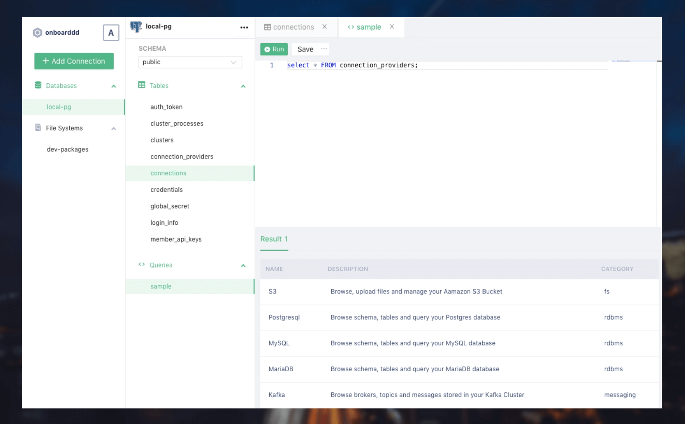

  
   
  

    <h3>
      <b>
        Heapland
      </b>
    </h3>
  

  

    <b>
      Universal interface for all your data services
    </b>
  

  

  

  

   
  

### Features

- Lightweight interface for relational database, object storage and streaming data infrastructure
- Browse AWS S3 Bucket
- Query relational databases like - Postgresql, MySQL and MariaDB

### Roadmap

- Object Storage/ File System
  - [x] Amazon S3
  - [ ] HDFS
  - [ ] MinIO
- Relational Databases
  - [x] Postgresql
  - [x] MySQL
  - [x] MariaDB
  - [ ] AWS RDS/Aurora
  - [ ] Clickhouse
- NoSQL Databases
  - [ ] Cassandra
  - [ ] MongoDB
  - [ ] Amazon Keyspaces
 

